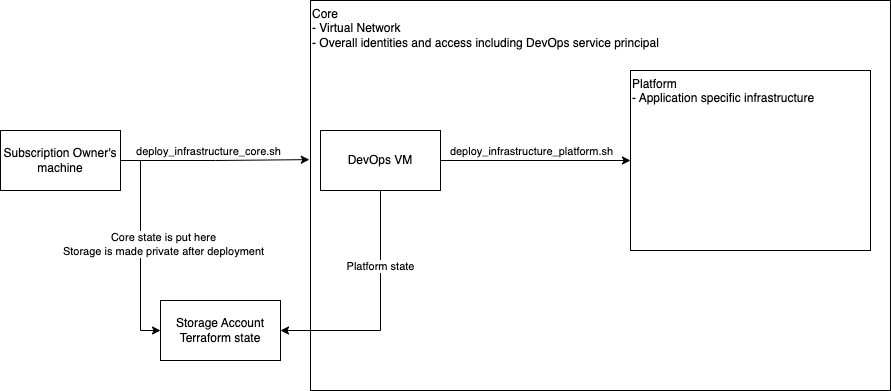

# Template Populator

This projects provides the code for an Azure function that receives 
1. the URL's of a `docx` template document
2. a map of how to fill in the template
3. an output path where the resulting pdf will be stored
The storage media are blob storages. The template populator applies the map to the document and saves it as a pdf.

# Requirements
- Azure account and subscription
- Libre Office (for local development)
- Docker
- [Azure CLI](https://learn.microsoft.com/en-us/cli/azure/)
- Terraform

# Setup

## Secrets
Create `secrets/config.sh` as such
```
export SUBSCRIPTION_ID="..."
export PROJECT_NAME="..."
export ENV_NAME="..."
# check your user's object ID in Azure Entra ID
export TF_VAR_owners_entra_object_ids='["..."]'
```

Generate an ssh key `ssh-keygen -t rsa`  for the login on the DevOps VM
at path: `secrets/id_devopsvm`

## Deployment
First, deploy the authorization, networking and CICD VM.
```
./cicd/deploy_infrastructure_core.sh apply
```

Then, load or update the code on the DevOps VM
```
./cicd/vm_load_code.sh
```

Upload secrets that were created during the core deployment (e.g. service principal)
```
./cicd/vm_load_secrets.sh
```

Login
```
./cicd/vm_login.sh
```

and deploy application layer infrastructure
```
cd ~/TemplatePopulator
./cicd/deploy_infrastructure_platform.sh apply
```


Deploy the app
```
./cicd/deploy_template_populator.sh
```

# Example 
## MacOs - ZShell
```
export STORAGE_ACCOUNT_NAME=<storage account name>
export FUNC_APP_NAME=<function app name>
export FUNC_KEY=<function key>

curl -v -G https://${FUNC_APP_NAME}.azurewebsites.net/api/healthcheck?code=${FUNC_KEY}

az storage blob upload -f template_populator/test_data/TestTemplate.docx --account-name ${STORAGE_ACCOUNT_NAME} -c templates -n test_template_123.docx

curl -X POST -v -H 'x-functions-key: ${FUNC_KEY}' -H 'Content-Type: application/json' -d '{"placeholder_map": {"PLACEHOLDER": "world"}, "template_docx_blob_path": "https://${STORAGE_ACCOUNT_NAME}.blob.core.windows.net/templates/test_template_123.docx", "document_pdf_blob_path": "https://${STORAGE_ACCOUNT_NAME}.blob.core.windows.net/documents/test_document_123.pdf"}' 'https://${FUNC_APP_NAME}.azurewebsites.net/api/populated-document'

az storage blob download -f test_document_123.pdf --account-name ${STORAGE_ACCOUNT_NAME} -c documents -n test_document_123.pdf

az storage blob delete --account-name ${STORAGE_ACCOUNT_NAME} -c documents -n test_document_123.pdf
az storage blob delete --account-name ${STORAGE_ACCOUNT_NAME} -c templates -n test_template_123.docx
```

## Ubuntu - Bash
```
curl -v -G https://${FUNC_APP_NAME}.azurewebsites.net/api/healthcheck?code=${FUNC_KEY}

curl -X POST -v -H "x-functions-key: ${FUNC_KEY}" -H "Content-Type: application/json" -d "{\"placeholder_map\": {\"PLACEHOLDER\": \"world\"}, \"template_docx_blob_path\": \"https://${STORAGE_ACCOUNT_NAME}.blob.core.windows.net/templates/TestTemplate.docx\", \"document_pdf_blob_path\": \"https://${STORAGE_ACCOUNT_NAME}.blob.core.windows.net/documents/test_document_123.pdf\"}" https://${FUNC_APP_NAME}.azurewebsites.net/api/populated-document
```

# Local development
1. conda create -p ./venv python=3.11
2. pip install -r requirements.txt
3. pip install -e .

If you have to modify the environment to run tests locally, create a dot-env file `.env`.

# Config
This project uses `dotenv`. The configuration hierarchy is (highest to lowest)
1. Environment variables
2. `.env` file
3. default values in `cfg.py`, check this file to figure out what environment variables are relevant

# Tests
```
pytest
```

# Run function locally
```
cd az_func
func start
```

# Run container locally
```
export PROJECT_ROOT=$(pwd)
docker build -t  -f ${PROJECT_ROOT}/az_func/Dockerfile ${PROJECT_ROOT}
docker run --rm -it -p 7071:80 tpopdevacr.azurecr.io/tpopdevfuncimg:latest
Request `curl http://localhost:7071/api/healthcheck`
```

# ToDo
Container (Storage) creation needs a `depends_on` for either permission or private endpoint
```
Error: checking for existing Container "documents" (Account "Account \"tpop3devsta\" (IsEdgeZone false / ZoneName \"\" / Subdomain Type \"blob\" / DomainSuffix \"core.windows.net\")"): executing request: unexpected status 403 (403 This request is not authorized to perform this operation.) with AuthorizationFailure: This request is not authorized to perform this operation.
```